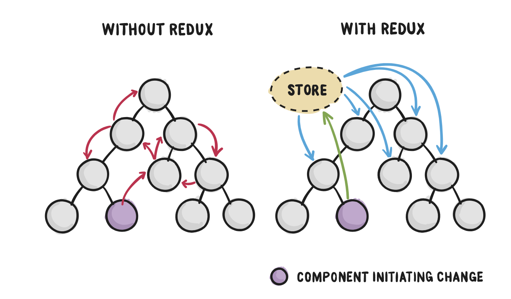

# hangout-react200

### [화살표 함수](./src/component/R013_ArrowFunction.js#L34)
- [익명함수에서 콜백함수 내부 this란](./src/component/R013_ArrowFunction.js#L35-L36)
- [익명함수에서 콜백함수 내부에서 함수 밖의 this를 접근하기 위해서](./src/component/R013_ArrowFunction.js#L48-L51)
- [익명함수와 화살표 함수의 차이를 확인 할 수 있는 예제](./src/component/R013_ArrowFunction.js#L52-L55)

### [props 자료형 선언하기](./src/component/R018_PropsDatatype.js)
- [props 자료형 선언 proTypes](./src/component/R018_PropsDatatype.js#L23-L36)

### [참조값](./src/component/R028_PureComponentClass.js)
- [참조 값이란](./src/component/R028_PureComponentClass.js#L34-L36)

### [axios get 사용하기](./src/component/R061_AxiosGet.js)
- [axios get 사용방법](./src/component/R061_AxiosGet.js#L13-L16)

### [axios post 사용하기](./src/component/R062_AxiosPost.js)
- [axios get 사용방법](./src/component/R062_AxiosPost.js#L13-L16)

### [하이오더 컴포넌트 구현하기](./src/Hoc/R075_ReactHoc.js)
- [하이오더 컴포넌트](./src/Hoc/withHocComponent.js)

### [컨텍스트 api 사용하기](./src/Context/R076_ContextApi.js)
- [자식 컴포넌트](./src/Context/contextChildren.js)
- [손자 컴포넌트](./src/Context/contextChildren2.js)

### [react img 태그 사용하기 ](./src/component/LoginForm.js)
- [참조](https://gomgomkim.tistory.com/11)

### redux 기초
- redux react 비교 
  


### [MYSQL 서버 구축하기 - AWS 가입하기](https://aws.amazon.com/ko/)
- react와 node 서버거 구동될 EC2라는 ubuntu 서버와 DB(mysql) 서버로 사용될 RDS 서버다.

### MYSQL 서버 구축하기 - RDS 인스턴스 생성하기
- 서비스 > 데이터베이스 > RDS > RDS Dashboard > 데이터베이스 생성
- MYSQL 선택 후 나머지는 설정하지 않는다
- 템플릿은 프리티어로 설정한다. 
- DB 인스턴스 식별자는 사용할 인스턴스의 명칭을 입력하고 마스터 암호는 DB 툴과 node 서버에서 사용된다.
- "스토리지 자동 조정화는 사용량에 따라 과금이되므로 체크 해제한다."
- 퍼블릭 엑세스 허용을 예로 체크하여 외부 DB툴에서도 접속할 수 있게한다. 
- 데이터베이스 포트가 3306인지 확인한다.
- 데이터베이스 생성 버튼을 누르면 RDS 인스턴스가 생성된다.
- 인스턴스 생성이 완료되면 인스턴스 상태가 사용가능이 표시된다 (좀 시간이 걸렸었음)

### MYSQL 서버 구축하기 - RDS 인스턴스 포트 설정하기
- 서비스 > 컴퓨팅 > EC2 > 보안그룹 > 보안그룹 ID (보안그룹 이름이 default인 보안 그룹 ID 선택
- 인바운드 포트를 추가하기 위해 인바운드 규칙 편집을 클릭한다.
- 규칙 추가를 눌러 MYSQL/Aurora인 3306 포트의 규칙을 입력하고 규칙 저장을 한다.

  
---

## etc.

### 잘못된 이전 커밋 수정하기

```bash

  # 상태 확인하기
  git status 

  # staged 상태의 파일을 unstaged로 옮기기
  git restore --staged <file>...

  # unstaged 상태 확인하기
  git status 

  # 이전 커밋 고치기 
  git commit --amend
    # vi 열림
    # `i` insert 모드 변경
    # 커밋 메시지 수정
    # `esc` 키
    # :wq 입력

  # 변경 내용 확인하기
  git log
    # `q`로 탈출
```